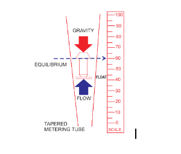
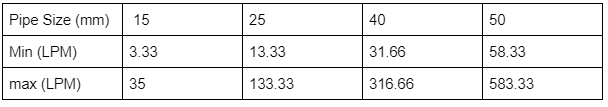

### Theory

**Introduction**

Rotameters are also known as variable area flow meters. Variable area flow meters work by measuring the flow rate as the fluid travels through a tapered tube where the cross sectional area of the tube gradually becomes greater as the fluid travels through the tube. The term rotameter comes from the early version of the floats, which had slots to help stabilize and center them within the fluid flow. This caused the floats to rotate. Current float designs are a variety of shapes (spherical for example) and are constructed of stainless steel, glass, metal, and plastic.

Rotameter is one kind of flow meter which is a veriable area type of flow meter. It consists of verically placed glass tapered tube and metallic float free to move up and down within the tube. The metering tube placed vertically along with fluid stream with a larger diameter at the top, fluid enters at the bottom of the tube and passes over the float and leaves the top. The maximum diameter of float is approximately same as the inlet diameter of the tube, when fluid enters at the bottom of tube float start rises in the tube. When there is no flow in the tube float is settled at the bottom of metering tube, fluid enters at the bottom of the tube the buoyant effect will act on the float but float density higher than the fluid, position of float still in the bottom of tube. Increasing the flow rate of fluid until buoyant effect of fluid greater than weight of float and then float starts to rise in the tube, it can be move up to top end of tapered tube. when buoyant force and drag force of the fluid on the float is same as that of weight of float and then float starts to rise in the tube, it can be move up to top end of tapered tube. When buoyant force and drag force of the fluid on the float is same as that of weight of float, then the float is in dynamic equilibrium. This position of float corresponeds to the particular flow rate of the fluid. If there is increase in the flow rate of fluid float rises upward in the tube flow rate causes drop in height of float in the tube. So flow rate of the fluid can be measured in the rotameter by direct reading the position of float in the metering tube.

**Construction and Working**

A typical meter of this kind, which is commonly as a Rotameter consists of a tapered tube with the smallest diameter at the bottom. The tube contains a freely moving float, which rests on a stop at the base of the tube. 

When a fluid or gas flow through a taper tube containing a float, a pressure difference of P1 and P2 is created between the upper and lower side of the float. The float moves upwards by a force obtained by multiplying the pressure differential by the maximum cross-sectional area of the float. Due to the nature of the taper tube as the float moves upwards, the fluid passing area increase as a result of which the differential pressure decreases. The upward movements of float stops when the differential pressure dynamically balances the dead load. The tapering of the metering tube is so designed that the vertical movement of the float becomes linearly proportional to the rate of flow and the scale is provided to read the position of the float, thus bringing birth to the flow indication. 

**Experimental Setup**

The setup consists of 3-30 LPM (Liters per minute) glass tube Rotameter, 0.50 HP Monoblock pump with supply and bypass line. The water is pumped from the sump tank through a horizontal pipe. The rate of flow of water is controlled by variable frequency drive VFD. Rotameter is connected to the sections of pipe by threads.

**Calculation of Flow rate**

						

**Advantages** 
- The cost of rotameter is low.
- It provides linear scale.
- It has good accuracy for low and medium flow rates.
- The pressure loss is nearly constant and small.
- Usability for corrosive fluid.
- It is simply used with switches, alarms, or any transmitting devices.

**Disadvantages**
- When opaque fluid is used, float may not be visible.
- It has not been suitable in pulsating services.
- Glass tube types subjected to breakage.
- It must be installed in vertical position only.
- It is restricted to little pipe services.
- It is restricted to low temperatures.
- Its accuracy is &plusmn; 1/2 to 10%.

**Applications** 
- The rotameter is used in process industries.
- It is used for monitoring gas and water flow in plants or labs.
- It is used for monitoring filtration loading
- These are used where there is a quality air supply is required.
- Used in the medical field for measurement of oxygen flow rate.

